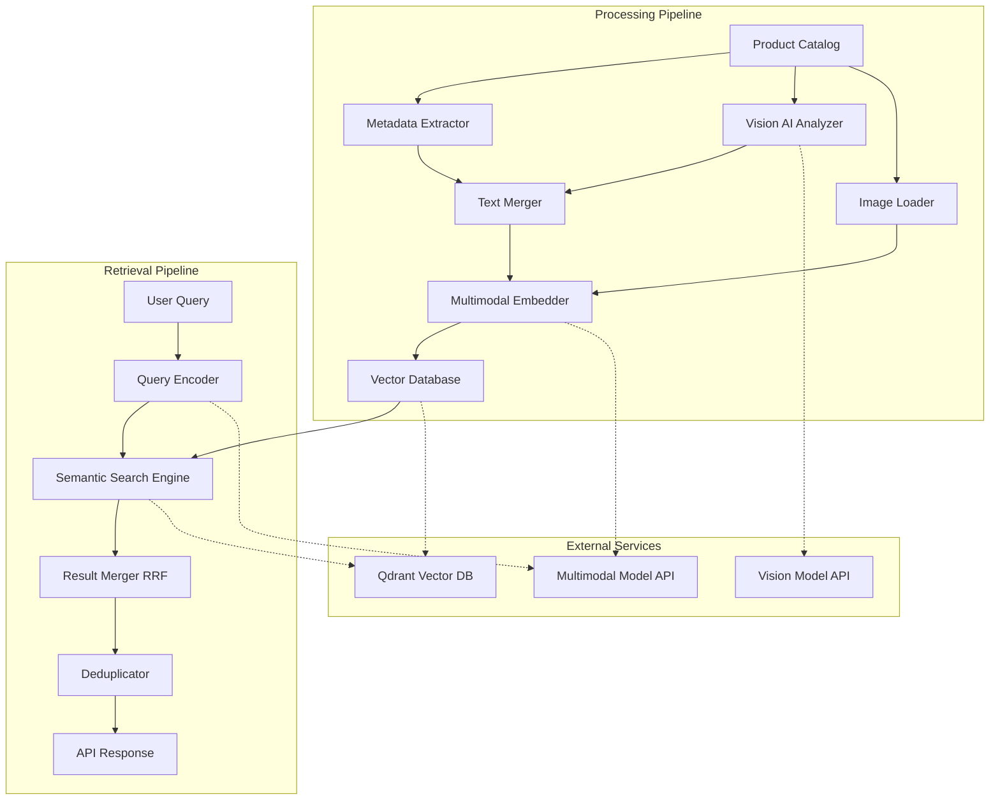

# Design Document: Glance Visual Semantic Search

## Overview

Glance is a visual semantic search system that enables intuitive product discovery for fashion e-commerce platforms through multimodal semantic search. The system combines textual product metadata with AI-derived visual attributes to understand and match descriptive, vibe-specific queries like "summer solid light blue linen shirt."

The architecture consists of two independent pipelines:

1. **Processing Pipeline (Indexing)**: Extracts product data, analyzes images with vision AI, generates embeddings using a multimodal model, and stores them in a vector database
2. **Retrieval Pipeline (Query Handling)**: Encodes user queries, performs semantic search across both text and image modalities, merges results using Reciprocal Rank Fusion (RRF), and returns ranked product IDs

The system is built with Python and FastAPI, leveraging free API-accessible AI models for embeddings and vision analysis, with Qdrant as the vector database.

## Architecture

### High-Level Architecture



### Component Interaction Flow

**Processing Pipeline Flow:**
1. Metadata Extractor reads product catalog and extracts structured data
2. Vision AI Analyzer sends images to external vision model API for attribute extraction
3. Text Merger combines metadata and visual attributes into unified descriptions
4. Multimodal Embedder generates text embeddings from descriptions
5. Image Loader prepares images for embedding generation
6. Multimodal Embedder generates image embeddings
7. Both embeddings are stored in Vector Database with product ID references

**Retrieval Pipeline Flow:**
1. Query Encoder receives user query and generates query embedding
2. Semantic Search Engine performs two parallel searches: text similarity and image similarity
3. Result Merger applies RRF algorithm to combine ranked results
4. Deduplicator removes duplicate product IDs
5. API Response returns top 3 unique product IDs

### Technology Stack

- **Backend Framework**: FastAPI (Python 3.10+)
- **Vector Database**: Qdrant (cloud-hosted free tier)
- **Multimodal Model**: Jina AI CLIP v2 (free API with 1M requests/month) - used for BOTH text and image embeddings to ensure shared semantic space
- **Vision Model**: LLaVA via Replicate API (free tier) or GPT-4o-mini for attribute extraction
- **HTTP Client**: httpx for async API calls
- **Configuration**: pydantic-settings for environment-based config
- **Logging**: structlog for structured JSON logging
- **Property Testing**: Hypothesis for property-based testing

## Components and Interfaces

### 1. Metadata Extractor

**Responsibility**: Extract product metadata from catalog source

**Interface**:
```python
class MetadataExtractor:
    def extract_products(self, catalog_source: str) -> List[ProductMetadata]:
        """
        Extract product metadata from catalog.
        
        Args:
            catalog_source: Path or URL to product catalog
            
        Returns:
            List of ProductMetadata objects
            
        Raises:
            CatalogAccessError: If catalog cannot be accessed
        """
        pass
```

**Implementation Notes**:
- Supports JSON file input initially (extensible to Shopify API)
- Validates product ID uniqueness
- Logs warnings for missing optional fields
- Continues processing on individual product failures

### 2. Vision AI Analyzer

**Responsibility**: Extract visual attributes from product images using external vision model

**Interface**:
```python
class VisionAnalyzer:
    def __init__(self, api_client: VisionAPIClient):
        self.api_client = api_client
    
    def analyze_image(self, image_url: str) -> VisualAttributes:
        """
        Analyze product image and extract attributes.
        
        Args:
            image_url: URL to product image
            
        Returns:
            VisualAttributes containing material, color, fit, texture
            
        Raises:
            VisionAPIError: If API call fails after retries
        """
        pass
```

**Implementation Notes**:
- Uses structured prompting to extract specific attributes
- Implements exponential backoff for rate limiting
- Caches results to avoid redundant API calls
- Returns partial results if some attributes cannot be extracted

### 3. Text Merger

**Responsibility**: Combine textual metadata with visual attributes into unified description

**Interface**:
```python
class TextMerger:
    def merge(self, metadata: ProductMetadata, visual_attrs: VisualAttributes) -> str:
        """
        Merge metadata and visual attributes into unified text.
        
        Args:
            metadata: Product metadata from catalog
            visual_attrs: Attributes extracted from image
            
        Returns:
            Unified text description for embedding
        """
        pass
```

**Implementation Notes**:
- Uses template-based merging with priority ordering
- Deduplicates overlapping attributes (e.g., color from both sources)
- Formats output for optimal embedding quality
- Handles missing attributes gracefully

### 4. Multimodal Embedder

**Responsibility**: Generate embeddings for text and images using shared semantic space

**Interface**:
```python
class MultimodalEmbedder:
    def __init__(self, api_client: EmbeddingAPIClient):
        self.api_client = api_client
    
    def embed_text(self, text: str) -> np.ndarray:
        """
        Generate text embedding.
        
        Args:
            text: Text to embed
            
        Returns:
            Embedding vector as numpy array
            
        Raises:
            EmbeddingAPIError: If API call fails
        """
        pass
    
    def embed_image(self, image_url: str) -> np.ndarray:
        """
        Generate image embedding.
        
        Args:
            image_url: URL to image
            
        Returns:
            Embedding vector as numpy array
            
        Raises:
            EmbeddingAPIError: If API call fails
        """
        pass
```

**Implementation Notes**:
- CRITICAL: Uses the exact same model instance for both text and image embeddings to ensure shared semantic space (Requirement 3.4)
- This is essential for semantic search to work correctly across modalities
- Normalizes embeddings to unit vectors for cosine similarity
- Implements retry logic with exponential backoff
- Validates embedding dimensions match expected size (typically 768 for Jina CLIP v2)

### 5. Vector Database Client

**Responsibility**: Store and retrieve embeddings with metadata

**Interface**:
```python
class VectorDBClient:
    def __init__(self, connection_config: QdrantConfig):
        self.client = QdrantClient(**connection_config)
    
    def store_product(self, product_id: str, text_embedding: np.ndarray, 
                     image_embedding: np.ndarray) -> None:
        """
        Store product embeddings in vector database.
        
        Args:
            product_id: Unique product identifier
            text_embedding: Text embedding vector
            image_embedding: Image embedding vector
            
        Raises:
            VectorDBError: If storage fails after retries
        """
        pass
    
    def search_by_text(self, query_embedding: np.ndarray, top_k: int = 3) -> List[SearchResult]:
        """
        Search for similar products by text embedding.
        
        Args:
            query_embedding: Query embedding vector
            top_k: Number of results to return
            
        Returns:
            List of SearchResult with product_id and similarity score
        """
        pass
    
    def search_by_image(self, query_embedding: np.ndarray, top_k: int = 3) -> List[SearchResult]:
        """
        Search for similar products by image embedding.
        
        Args:
            query_embedding: Query embedding vector
            top_k: Number of results to return
            
        Returns:
            List of SearchResult with product_id and similarity score
        """
        pass
```

**Implementation Notes**:
- Uses separate collections for text and image embeddings
- Implements connection pooling for performance
- Retries failed operations up to 3 times
- Validates embeddings before storage

### 6. Query Encoder

**Responsibility**: Encode user search queries into embeddings

**Interface**:
```python
class QueryEncoder:
    def __init__(self, embedder: MultimodalEmbedder):
        self.embedder = embedder
    
    def encode(self, query: str) -> np.ndarray:
        """
        Encode user query into embedding.
        
        Args:
            query: User search query text
            
        Returns:
            Query embedding vector
            
        Raises:
            ValidationError: If query is empty or invalid
            EmbeddingAPIError: If encoding fails
        """
        pass
```

**Implementation Notes**:
- Validates query is non-empty and contains meaningful content
- Preprocesses query text (lowercase, trim whitespace)
- Uses same embedder as indexing pipeline for consistency

### 7. Semantic Search Engine

**Responsibility**: Execute semantic search across both modalities

**Interface**:
```python
class SemanticSearchEngine:
    def __init__(self, vector_db: VectorDBClient):
        self.vector_db = vector_db
    
    def search(self, query_embedding: np.ndarray) -> SearchResults:
        """
        Perform semantic search across text and image modalities.
        
        Args:
            query_embedding: Encoded query vector
            
        Returns:
            SearchResults containing separate text and image result lists
        """
        pass
```

**Implementation Notes**:
- Executes text and image searches in parallel for performance
- Returns top 3 results from each modality
- Includes similarity scores for ranking

### 8. Result Merger (RRF)

**Responsibility**: Merge results from multiple modalities using Reciprocal Rank Fusion

**Interface**:
```python
class RRFMerger:
    def __init__(self, k: int = 60):
        self.k = k
    
    def merge(self, text_results: List[SearchResult], 
             image_results: List[SearchResult]) -> List[str]:
        """
        Merge and rank results using RRF algorithm.
        
        Args:
            text_results: Results from text search
            image_results: Results from image search
            
        Returns:
            List of product IDs ranked by RRF score
        """
        pass
```

**Implementation Notes**:
- Implements RRF formula exactly as specified in Requirement 15.1: score = sum(1 / (k + rank_i))
- Default k=60 (standard RRF parameter, configurable per Requirement 15.2)
- Handles products appearing in only one result list (Requirement 15.3)
- Ranks starting from 1 for top result (Requirement 15.5)
- Sorts final results by descending RRF score (Requirement 15.4)

### 9. Deduplicator

**Responsibility**: Remove duplicate product IDs and return top N unique results

**Interface**:
```python
class Deduplicator:
    def deduplicate(self, ranked_product_ids: List[str], top_n: int = 3) -> List[str]:
        """
        Remove duplicates and return top N unique products.
        
        Args:
            ranked_product_ids: Product IDs in ranked order
            top_n: Number of unique results to return
            
        Returns:
            List of top N unique product IDs
        """
        pass
```

**Implementation Notes**:
- Preserves ranking order from RRF
- Returns fewer than top_n if insufficient unique products
- Uses set for O(1) duplicate detection

### 10. FastAPI Application

**Responsibility**: Expose REST API endpoints for search and health checks

**Interface**:
```python
@app.post("/search")
async def search(request: SearchRequest) -> SearchResponse:
    """
    Search for products using semantic search.
    
    Args:
        request: SearchRequest with query text
        
    Returns:
        SearchResponse with product IDs array
    """
    pass

@app.get("/health")
async def health_check() -> HealthResponse:
    """
    Check system health and dependency status.
    
    Returns:
        HealthResponse with status and dependency details
    """
    pass

@app.post("/index")
async def index_catalog(request: IndexRequest) -> IndexResponse:
    """
    Trigger indexing of product catalog.
    
    Args:
        request: IndexRequest with catalog source
        
    Returns:
        IndexResponse with processing status
    """
    pass
```

**Implementation Notes**:
- Uses async handlers for non-blocking I/O
- Implements request validation with Pydantic models
- Returns appropriate HTTP status codes
- Includes error handling middleware
- PERFORMANCE REQUIREMENT: Must respond within 2 seconds for 95% of search requests (Requirement 8.5)
- Implements request timeout handling and monitoring

## Data Models

### ProductMetadata
```python
@dataclass
class ProductMetadata:
    product_id: str
    title: str
    description: str
    tags: List[str]
    attributes: Dict[str, str]  # e.g., {"color": "blue", "size": "M"}
    image_url: str
```

### VisualAttributes
```python
@dataclass
class VisualAttributes:
    material: Optional[str]  # e.g., "linen", "cotton"
    color: Optional[str]     # e.g., "light blue", "navy"
    fit: Optional[str]       # e.g., "slim", "relaxed"
    texture: Optional[str]   # e.g., "smooth", "textured"
```

### SearchResult
```python
@dataclass
class SearchResult:
    product_id: str
    score: float
    rank: int
```

### SearchResults
```python
@dataclass
class SearchResults:
    text_results: List[SearchResult]
    image_results: List[SearchResult]
```

### API Models

```python
class SearchRequest(BaseModel):
    query: str = Field(..., min_length=1, description="Search query text")

class SearchResponse(BaseModel):
    product_ids: List[str] = Field(..., description="Ranked product IDs")
    processing_time_ms: int

class IndexRequest(BaseModel):
    catalog_source: str = Field(..., description="Path or URL to catalog")
    batch_size: int = Field(default=10, ge=1, le=100)

class IndexResponse(BaseModel):
    status: str
    products_processed: int
    products_failed: int

class HealthResponse(BaseModel):
    status: str  # "healthy" or "unhealthy"
    vector_db: str  # "connected" or "disconnected"
    embedding_api: str  # "accessible" or "inaccessible"
    vision_api: str  # "accessible" or "inaccessible"
```

### Configuration Models

```python
class QdrantConfig(BaseModel):
    url: str
    api_key: str
    collection_name_text: str = "products_text"
    collection_name_image: str = "products_image"

class EmbeddingAPIConfig(BaseModel):
    api_key: str
    endpoint: str
    model_name: str

class VisionAPIConfig(BaseModel):
    api_key: str
    endpoint: str
    model_name: str

class AppConfig(BaseModel):
    qdrant: QdrantConfig
    embedding_api: EmbeddingAPIConfig
    vision_api: VisionAPIConfig
    batch_size: int = 10
    retry_limit: int = 3
    timeout_seconds: int = 30
    rrf_k_value: int = 60  # Configurable RRF constant (Requirement 15.2)
```


## Correctness Properties

*A property is a characteristic or behavior that should hold true across all valid executions of a system—essentially, a formal statement about what the system should do. Properties serve as the bridge between human-readable specifications and machine-verifiable correctness guarantees.*

### Property 1: Complete Metadata Extraction

*For any* product catalog, when the Processing Pipeline extracts metadata, all products should have product_id, title, description, tags, attributes, and image_url fields populated or explicitly marked as missing.

**Validates: Requirements 1.1, 1.2**

### Property 2: Graceful Handling of Missing Metadata

*For any* product with missing optional metadata fields, the system should log a warning and continue processing the product without failing.

**Validates: Requirements 1.3**

### Property 3: Product ID Uniqueness Validation

*For any* product catalog, if duplicate product IDs exist, the system should detect and reject them before processing.

**Validates: Requirements 1.4**

### Property 4: Visual Attribute Extraction Structure

*For any* product image successfully analyzed by Vision AI, the extracted attributes should contain fields for material, color, fit, and texture (even if some values are None).

**Validates: Requirements 2.1, 2.2**

### Property 5: Vision AI Failure Resilience

*For any* product where image analysis fails, the system should log the error and continue processing using only textual metadata without failing the entire pipeline.

**Validates: Requirements 2.3**

### Property 6: Attribute Storage Persistence

*For any* product with extracted visual attributes, those attributes should be stored and retrievable alongside the product metadata.

**Validates: Requirements 2.4**

### Property 7: Text Merging Completeness

*For any* product with both metadata and visual attributes, the merged text description should contain information from both sources without loss of key attributes.

**Validates: Requirements 3.1**

### Property 8: Shared Semantic Space Consistency

*For any* text or image embedding generated by the Multimodal Model, the embedding dimension should match the expected model output dimension, be consistent across all embeddings, and both text and image embeddings must be generated by the same model instance to ensure they exist in a shared semantic space.

**Validates: Requirements 3.2, 3.3, 3.4**

### Property 9: Embedding Generation Failure Handling

*For any* product where embedding generation fails, the system should log the error and skip that product without affecting other products in the batch.

**Validates: Requirements 3.5**

### Property 10: Complete Product Storage

*For any* product with generated embeddings, both text and image embeddings should be stored in the Vector Database with correct product ID associations maintained.

**Validates: Requirements 4.1, 4.2, 4.3**

### Property 11: Storage Retry Logic

*For any* storage operation that fails, the system should retry up to 3 times with exponential backoff before logging a final failure.

**Validates: Requirements 4.4**

### Property 12: Processing Status Tracking

*For any* batch of products processed, the system should maintain an accurate index tracking which products have been successfully stored and which failed.

**Validates: Requirements 4.5**

### Property 13: Query Encoding Execution

*For any* valid non-empty search query, the Retrieval Pipeline should successfully encode it into an embedding vector.

**Validates: Requirements 5.1**

### Property 14: Query Validation

*For any* query string that is empty or contains only whitespace, the system should reject it with a validation error before attempting encoding.

**Validates: Requirements 5.4**

### Property 15: Query Encoding Failure Response

*For any* query where encoding fails due to API errors, the system should return an appropriate error response to the client with details.

**Validates: Requirements 5.3**

### Property 16: Semantic Search Execution

*For any* valid query embedding, the Semantic Search Engine should perform searches against both text and image collections in the Vector Database.

**Validates: Requirements 6.1**

### Property 17: Top-K Result Retrieval

*For any* semantic search operation, the system should retrieve exactly top 3 results from both text similarity search and image similarity search (or fewer if insufficient products exist).

**Validates: Requirements 6.2, 6.3**

### Property 18: Similarity Score Calculation

*For any* search result returned, it should include a valid similarity score between 0 and 1 (for cosine similarity).

**Validates: Requirements 6.4**

### Property 19: Database Unavailability Handling

*For any* search request when the Vector Database is unavailable, the system should return an error response indicating the service is temporarily unavailable.

**Validates: Requirements 6.5**

### Property 20: RRF Merging Correctness

*For any* pair of ranked result lists (text and image), the RRF algorithm should calculate scores using the formula score = sum(1 / (k + rank_i)), normalize ranks starting from 1, and return results sorted by descending RRF score.

**Validates: Requirements 7.1, 7.4, 15.1, 15.4, 15.5**

### Property 21: Result Deduplication

*For any* merged result list containing duplicate product IDs, the deduplicator should remove duplicates while preserving the highest-ranked occurrence of each product.

**Validates: Requirements 7.2**

### Property 22: Top-N Unique Results

*For any* deduplicated result list, the system should return exactly 3 unique product IDs when available, or all available unique products if fewer than 3 exist.

**Validates: Requirements 7.3, 7.5 (edge case)**

### Property 23: API Response Structure

*For any* successful search request, the API should return a JSON response with HTTP 200 status containing an array of product IDs and processing time.

**Validates: Requirements 8.1, 8.2, 8.3**

### Property 24: API Error Response

*For any* search request that encounters an error, the API should return an appropriate HTTP error code (4xx for client errors, 5xx for server errors) with a descriptive error message in JSON format.

**Validates: Requirements 8.4**

### Property 25: API Response Time Performance

*For any* set of 100 search requests under normal load conditions, at least 95 of them should complete and return a response within 2 seconds.

**Validates: Requirements 8.5**

### Property 26: API Credential Validation

*For any* system initialization, if API credentials for embedding or vision models are invalid or missing, the system should fail to start with a descriptive error message.

**Validates: Requirements 9.3**

### Property 27: Rate Limit Backoff

*For any* API call that receives a rate limit error, the system should implement exponential backoff retry logic with increasing delays between attempts.

**Validates: Requirements 9.4**

### Property 28: API Call Logging

*For any* external API call made to embedding or vision services, the system should log the call with timestamp, endpoint, and response status.

**Validates: Requirements 9.5**

### Property 29: Error Logging Structure

*For any* error encountered in any component, the system should log it with timestamp, component name, error type, and error details in structured JSON format.

**Validates: Requirements 10.1, 10.3**

### Property 30: Fault Tolerance in Batch Processing

*For any* batch of products being processed, if individual products fail, the system should continue processing remaining products and report both successes and failures.

**Validates: Requirements 10.2**

### Property 31: Performance Metrics Logging

*For any* indexing or query operation, the system should log performance metrics including operation duration and items processed.

**Validates: Requirements 10.4**

### Property 32: Critical Error Alerting

*For any* critical error (database connection failure, API authentication failure), the system should send alerts to configured monitoring endpoints if configured.

**Validates: Requirements 10.5**

### Property 33: Product ID Validation

*For any* product metadata extracted, if the product ID is empty or null, the system should reject that product with a validation error.

**Validates: Requirements 11.1**

### Property 34: Image URL Validation

*For any* image URL provided, the system should validate that it is a well-formed URL and accessible before attempting to process the image.

**Validates: Requirements 11.2**

### Property 35: Query Text Validation

*For any* query text received, if it contains only whitespace characters, the system should reject it with a validation error.

**Validates: Requirements 11.3**

### Property 36: Invalid Request Rejection

*For any* API request with invalid data (malformed JSON, missing required fields, invalid types), the system should reject it with HTTP 400 and a descriptive error message.

**Validates: Requirements 11.4**

### Property 37: Input Sanitization

*For any* text input (queries, descriptions, tags), the system should sanitize it to remove or escape potentially malicious content before processing.

**Validates: Requirements 11.5**

### Property 38: Configurable Batch Processing

*For any* catalog processing operation, the system should process products in batches of the configured batch size, not exceeding that size per batch.

**Validates: Requirements 12.1**

### Property 39: Independent Batch Commits

*For any* batch processed, the system should commit that batch to the Vector Database independently, such that one batch's failure does not affect other batches.

**Validates: Requirements 12.2**

### Property 40: Batch Retry Isolation

*For any* batch that fails processing, the system should retry only that batch without reprocessing successful batches.

**Validates: Requirements 12.3**

### Property 41: Batch Progress Tracking

*For any* multi-batch processing operation, the system should track and report progress showing how many batches have been completed, failed, and remain.

**Validates: Requirements 12.4**

### Property 42: Indexing Status API

*For any* indexing operation in progress or completed, the status API endpoint should return current progress including products processed, failed, and remaining.

**Validates: Requirements 12.5**

### Property 43: Configuration Loading

*For any* system startup, the system should successfully load configuration from environment variables or configuration files for all required settings (API keys, database URLs, model endpoints, batch sizes, retry limits, timeouts).

**Validates: Requirements 13.1, 13.2, 13.3**

### Property 44: Missing Configuration Detection

*For any* required configuration parameter that is missing, the system should fail to start and log a descriptive error message indicating which parameter is missing.

**Validates: Requirements 13.4**

### Property 45: Configuration Validation

*For any* configuration value loaded, the system should validate it is of the correct type and within acceptable ranges before using it.

**Validates: Requirements 13.5**

### Property 46: Health Check Completeness

*For any* health check request, the response should include status checks for Vector Database connectivity, embedding API accessibility, and vision API accessibility, returning HTTP 200 when all are healthy and HTTP 503 when any are unhealthy.

**Validates: Requirements 14.1, 14.2, 14.3, 14.4, 14.5**

### Property 47: RRF Parameter Configuration

*For any* RRF merge operation, the system should use the configured k value (default 60) in the RRF formula calculation.

**Validates: Requirements 15.2**

### Property 48: RRF Single-List Handling

*For any* product that appears in only one result list (text or image), the RRF algorithm should still calculate a valid score for it based on its rank in that single list.

**Validates: Requirements 15.3**

## Error Handling

### Error Categories

The system implements a hierarchical error handling strategy with the following categories:

1. **Validation Errors**: Input validation failures (empty queries, invalid URLs, malformed data)
   - HTTP 400 Bad Request
   - Descriptive error messages
   - No retries

2. **External API Errors**: Failures from embedding or vision model APIs
   - Exponential backoff retry (up to 3 attempts)
   - Rate limit handling with backoff
   - Fallback to partial processing when possible
   - HTTP 503 Service Unavailable if all retries fail

3. **Database Errors**: Vector database connection or operation failures
   - Retry with exponential backoff (up to 3 attempts)
   - Circuit breaker pattern for repeated failures
   - HTTP 503 Service Unavailable

4. **Processing Errors**: Individual product processing failures
   - Log error and continue with next product
   - Track failed products for reporting
   - Do not fail entire batch

5. **Critical Errors**: System initialization or configuration failures
   - Fail fast on startup
   - Send alerts to monitoring endpoints
   - Prevent system from starting in invalid state

### Error Response Format

All API errors return JSON responses with the following structure:

```json
{
  "error": {
    "code": "ERROR_CODE",
    "message": "Human-readable error description",
    "details": {
      "field": "Additional context"
    }
  }
}
```

### Retry Strategy

- **Exponential Backoff**: Initial delay 1s, multiplier 2x, max delay 30s
- **Max Retries**: 3 attempts for transient failures
- **Jitter**: Add random jitter (±20%) to prevent thundering herd
- **Circuit Breaker**: Open circuit after 5 consecutive failures, half-open after 60s

### Logging Strategy

All errors are logged with structured JSON format:

```json
{
  "timestamp": "2026-02-15T10:30:45Z",
  "level": "ERROR",
  "component": "VisionAnalyzer",
  "error_type": "VisionAPIError",
  "message": "Failed to analyze image after 3 retries",
  "context": {
    "product_id": "prod_123",
    "image_url": "https://...",
    "attempts": 3
  }
}
```

## Testing Strategy

### Dual Testing Approach

The system requires both unit testing and property-based testing for comprehensive coverage:

- **Unit Tests**: Verify specific examples, edge cases, and error conditions
- **Property Tests**: Verify universal properties across all inputs

Both testing approaches are complementary and necessary. Unit tests catch concrete bugs in specific scenarios, while property tests verify general correctness across a wide range of inputs.

### Unit Testing

Unit tests focus on:

1. **Specific Examples**: Concrete test cases demonstrating correct behavior
   - Example: Test RRF merge with specific ranked lists
   - Example: Test text merger with known metadata and attributes

2. **Edge Cases**: Boundary conditions and special cases
   - Empty result lists
   - Single-item batches
   - Products with all metadata missing
   - Queries at maximum length

3. **Error Conditions**: Specific error scenarios
   - API returning 429 rate limit
   - Database connection timeout
   - Invalid JSON responses

4. **Integration Points**: Component interactions
   - API endpoint request/response cycles
   - Database connection lifecycle
   - External API mocking

### Property-Based Testing

Property-based testing is implemented using **Hypothesis** (Python's leading property-based testing library).

**Configuration**:
- Minimum 100 iterations per property test (due to randomization)
- Each test tagged with comment referencing design property
- Tag format: `# Feature: glance-visual-semantic-search, Property {number}: {property_text}`

**Property Test Coverage**:

Each correctness property listed above must be implemented as a property-based test. Key properties include:

1. **Metadata Extraction Properties** (Properties 1-3)
   - Generate random product catalogs
   - Verify all fields extracted correctly
   - Verify duplicate detection

2. **Embedding Properties** (Properties 8, 13)
   - Generate random text and images
   - Verify embedding dimensions consistent
   - Verify embeddings are normalized
   - Verify same model used for both text and image embeddings (shared semantic space)

3. **RRF Algorithm Properties** (Properties 20, 47, 48)
   - Generate random ranked result lists
   - Verify RRF formula calculation
   - Verify score ordering
   - Verify handling of non-overlapping lists

4. **Validation Properties** (Properties 14, 33-37)
   - Generate invalid inputs (empty strings, whitespace, malformed URLs)
   - Verify all are rejected with appropriate errors

5. **Batch Processing Properties** (Properties 38-42)
   - Generate random batch sizes and product counts
   - Verify batching behavior
   - Verify fault isolation

6. **Deduplication Properties** (Properties 21-22)
   - Generate result lists with duplicates
   - Verify duplicates removed
   - Verify ranking preserved

7. **Performance Properties** (Property 25)
   - Generate sets of 100 search requests
   - Verify 95% complete within 2 seconds

**Example Property Test**:

```python
from hypothesis import given, strategies as st

# Feature: glance-visual-semantic-search, Property 20: RRF Merging Correctness
@given(
    text_results=st.lists(st.tuples(st.text(min_size=1), st.floats(0, 1)), min_size=1, max_size=10),
    image_results=st.lists(st.tuples(st.text(min_size=1), st.floats(0, 1)), min_size=1, max_size=10),
    k=st.integers(min_value=1, max_value=100)
)
def test_rrf_merging_correctness(text_results, image_results, k):
    """Property: RRF algorithm calculates scores correctly and sorts by descending score."""
    merger = RRFMerger(k=k)
    
    # Convert to SearchResult objects
    text_search_results = [SearchResult(pid, score, rank+1) 
                          for rank, (pid, score) in enumerate(text_results)]
    image_search_results = [SearchResult(pid, score, rank+1) 
                           for rank, (pid, score) in enumerate(image_results)]
    
    # Merge results
    merged = merger.merge(text_search_results, image_search_results)
    
    # Verify results are sorted by descending RRF score
    for i in range(len(merged) - 1):
        assert calculate_rrf_score(merged[i], k) >= calculate_rrf_score(merged[i+1], k)
    
    # Verify all results from input lists are present
    all_input_pids = {r.product_id for r in text_search_results + image_search_results}
    assert set(merged) == all_input_pids
```

### Test Organization

```
tests/
├── unit/
│   ├── test_metadata_extractor.py
│   ├── test_vision_analyzer.py
│   ├── test_text_merger.py
│   ├── test_embedder.py
│   ├── test_vector_db.py
│   ├── test_query_encoder.py
│   ├── test_search_engine.py
│   ├── test_rrf_merger.py
│   ├── test_deduplicator.py
│   └── test_api.py
├── property/
│   ├── test_metadata_properties.py
│   ├── test_embedding_properties.py
│   ├── test_rrf_properties.py
│   ├── test_validation_properties.py
│   ├── test_batch_properties.py
│   └── test_deduplication_properties.py
└── integration/
    ├── test_processing_pipeline.py
    ├── test_retrieval_pipeline.py
    └── test_end_to_end.py
```

### Testing Guidelines

1. **Balance**: Don't write excessive unit tests - property tests handle input coverage
2. **Focus**: Unit tests for specific examples and integration points
3. **Coverage**: Every correctness property must have a property-based test
4. **Isolation**: Mock external APIs in unit tests
5. **Performance**: Property tests should complete in reasonable time (<5s per test)
6. **Determinism**: Use Hypothesis's example database for reproducibility
